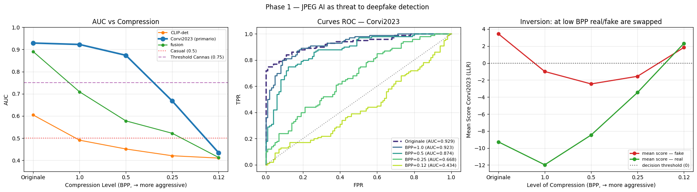
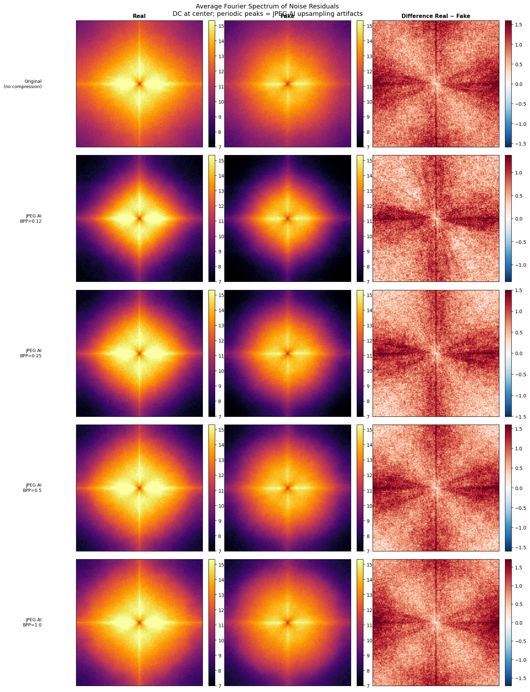
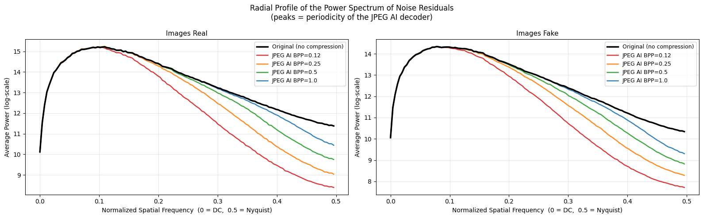
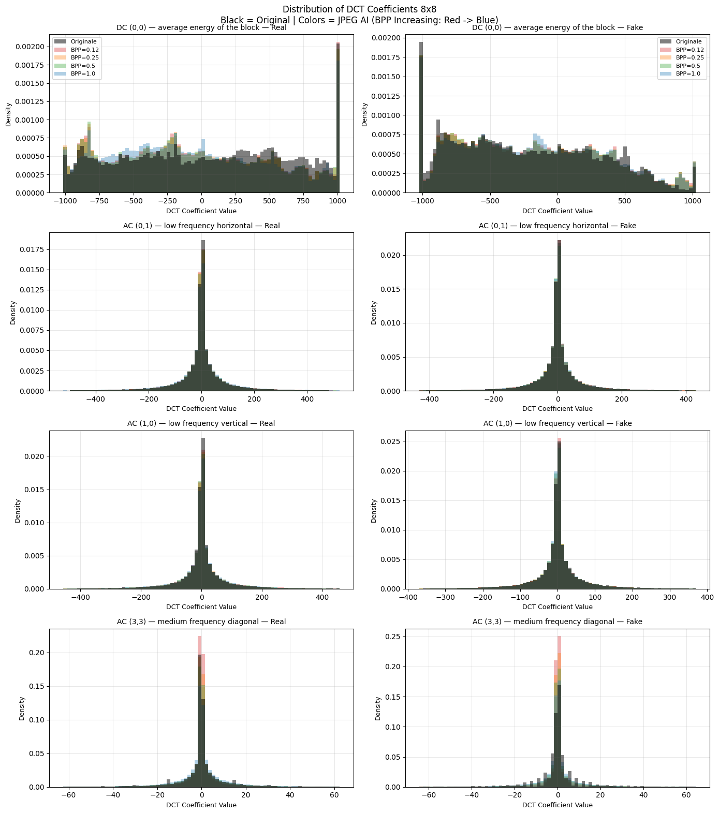
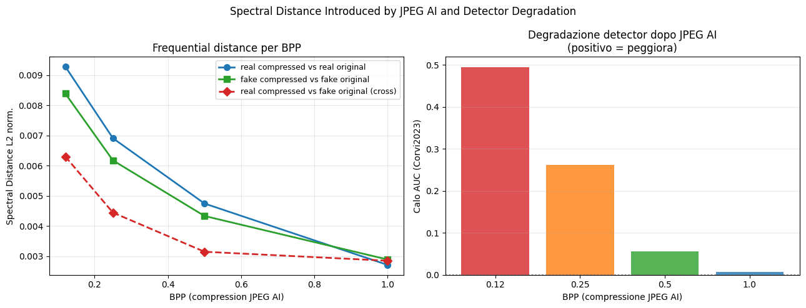
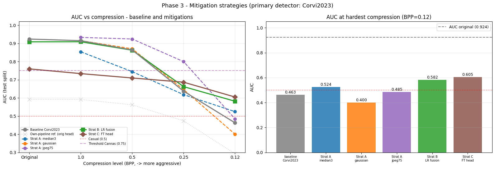

# JPEG AI as a Threat to Deepfake Detection

**Lorenzo Pizzi — 2187091**  
Computer Vision, A.A. 2025–2026 — Sapienza Università di Roma

---

## Overview

This project investigates whether **JPEG AI** compression (the first international standard for end-to-end learned image compression) undermines the reliability of state-of-the-art deepfake detectors.

JPEG AI encodes and decodes images using deep neural networks, producing compression artifacts with a fundamentally different statistical signature from classical JPEG. As shown by Cannas, these artifacts closely resemble the neural fingerprints left by image synthesis pipelines (GANs, diffusion models), causing forensic detectors to misclassify pristine compressed images as synthetically generated.

The project is structured in three phases:

1. **Phase 1** — Measure the counter-forensic effect of JPEG AI on deepfake detectors across multiple bitrates.
2. **Phase 2** — Explain *why* performance degrades through frequency-domain analysis.
3. **Phase 3** — Implement and compare mitigation strategies to recover detector robustness.

---

## Repository Structure

```
CV_Project.ipynb          # Main notebook (Google Colab, PyTorch)
Presentation.pdf  # Project presentation slides
assets/                   # Plots generated by the notebook
README.md
```

---

## Dataset

**OpenFake** (Kaggle) — ~20k real/fake image pairs generated by modern diffusion models.

- A balanced subset of **200 images** (100 real + 100 fake) was sampled from the test split with a fixed seed (42) for reproducibility.
- Dataset link: [OpenFake on Kaggle](https://www.kaggle.com/datasets/manjilkarki/deepfake-and-real-images)

OpenFake was chosen because its fake images come from diffusion-model generators, which isexactly the domain targeted by the primary detector (Corvi2023), making the counter-forensic effect measurable.

---

### External tools

- **JPEG AI Reference Software** — cloned and patched at runtime inside an isolated venv (numpy 1.x) due to incompatibility with the main environment (numpy 2.x).
- **CLIP-Det** ([grip-unina/ClipBased-SyntheticImageDetection](https://github.com/grip-unina/ClipBased-SyntheticImageDetection)) — cloned automatically; weights downloaded via Git LFS.

---

## Phase 1 — Baseline Evaluation Under Compression

### Compression Pipeline

Images were compressed using the **official JPEG AI Reference Software** at four target bitrates:

| Target BPP | Measured BPP |
|-----------|-------------|
| 0.12      | 0.122       |
| 0.25      | 0.258       |
| 0.50      | 0.511       |
| 1.00      | 1.014       |

Total: **800 reconstructions** (200 images × 4 BPP levels). The pipeline is resumable via a CSV manifest.

### Detectors

The CLIP-Det repository provides three scores in a single run:

- `clipdet_latent10k_plus` — CLIP-based detector
- `Corvi2023` — ResNet50 detector specialized on diffusion-model images 
- `fusion` — weighted combination of the two

**Corvi2023** achieved AUC = 0.93 on uncompressed images, meeting the Cannas criterion (AUC > 0.75) for a meaningful counter-forensic analysis.

### Results (AUC)

| BPP       | CLIP-Det | Corvi2023  | Fusion |
|-----------|----------|------------|--------|
| Original  | 0.604    | **0.929**  | 0.890  |
| 1.00      | 0.491    | **0.923**  | 0.709  |
| 0.50      | 0.451    | **0.874**  | 0.578  |
| 0.25      | 0.420    | **0.668**  | 0.522  |
| 0.12      | 0.410    | **0.434**  | 0.413  |

Corvi2023 collapses from AUC = 0.93 to **AUC = 0.43 at BPP = 0.12** — below chance, meaning the detector *inverts* its predictions: compressed real images are classified as fake more often than actual fakes.



---
    
## Phase 2 — Frequency-Domain Forensic Analysis

### Methodology

Following the approach of the paper I computed four metrics:

1. **2D Fourier spectra** of noise residuals (high-pass Gaussian filter, σ = 2) computed separately for real/fake at each BPP.
2. **1D radial profiles** (azimuthal average of 2D spectra) that expose periodic peaks introduced by JPEG AI's neural upsamplers.
3. **DCT 8×8 coefficient distributions** that quantify how JPEG AI alters block-frequency statistics.
4. **Spectral distance vs AUC drop** : three normalized L2 distances per BPP, including `dist_cross_real_origfake` (how spectrally similar compressed reals are to original fakes).

### Key Findings

- At low BPP, compressed real images develop **periodic high-frequency peaks** absent in originals — structurally identical to the grid artifacts that Corvi2023 is trained to detect in GAN/diffusion outputs.
- Fake images, already bearing neural fingerprints, are *less perturbed* by JPEG AI than real images.
- `dist_cross_real_origfake` grows monotonically as BPP decreases, tracking the AUC collapse. At BPP = 0.12, compressed reals are **spectrally closer to original fakes than to original reals**.
- This explains the inversion: Corvi2023 is not confused — it is correctly reading a neural fingerprint, but the fingerprint belongs to the codec, not to a generator.

**Average 2D Fourier spectra of noise residuals (real vs fake, per BPP):**



**Radial spectral profiles:**



**DCT 8×8 coefficient distributions:**



**Spectral distance vs AUC drop:**



---

## Phase 3 — Mitigation Strategies

The test_sample (200 images) is split into **100 calibration + 100 test** images (stratified, 50 real / 50 fake each). All Phase 3 results are reported on the held-out test split.

### Baseline (no mitigation)

| BPP      | AUC Corvi2023 |
|----------|---------------|
| Original | 0.9236        |
| 1.00     | 0.9148        |
| 0.50     | 0.8636        |
| 0.25     | 0.6368        |
| 0.12     | **0.4628**    |

### Strategy A — Compression-Aware Preprocessing (Training-Free)

Three spatial filters applied to compressed images before detection:

| BPP  | Baseline | median3    | gaussian | jpeg75     |
|------|----------|------------|----------|------------|
| 1.00 | 0.9148   | 0.8536     | 0.9152   | **0.9328** |
| 0.50 | 0.8636   | 0.7444     | 0.8700   | **0.9240** |
| 0.25 | 0.6368   | 0.6180     | 0.6460   | **0.7996** |
| 0.12 | 0.4628   | **0.5244** | 0.4004   | 0.4848     |

- **jpeg75** is the best filter at BPP ≥ 0.25: re-encoding with classical JPEG overwrites the JPEG AI neural fingerprint with block-DCT artifacts that Corvi2023 already knows how to ignore.
- **gaussian** makes things *worse* at BPP = 0.12 (AUC = 0.400): blurring destroys the residual real/fake signal along with the JPEG AI artifacts.
- **median3** is the only filter that provides any gain at BPP = 0.12 (+0.062).

### Strategy B — Per-BPP Adaptive Score Fusion (Logistic Regression)

A logistic regression is fitted per compression level on the calibration split, using the three CLIP-Det scores as features. The LR can re-weight and flip the sign of inverted detectors.

| Group    | Baseline AUC | LR AUC | ΔAUC       |
|----------|-------------|--------|------------|
| Original | 0.9236      | 0.9084 | −0.015     |
| BPP=1.0  | 0.9148      | 0.9088 | −0.006     |
| BPP=0.5  | 0.8636      | 0.8624 | −0.001     |
| BPP=0.25 | 0.6368      | 0.6620 | +0.025     |
| BPP=0.12 | 0.4628      | 0.5816 | **+0.119** |

- Best strategy at BPP = 0.12 among training-free approaches (+0.119).
- Zero extra inference cost (dot product on 3 scores). One-off calibration cost.

### Strategy C — Linear-Probe Fine-Tuning of Corvi2023

The ResNet50 backbone of Corvi2023 is frozen; only the linear head (`Linear(2048, 1)`) is retrained on compression-augmented calibration data. Each minibatch is sampled from a random group (original or one of the four BPP levels). Warm-started from the original Corvi2023 weights.

| Group    | Own-pipeline Baseline | Fine-Tuned AUC | Δ          |
|----------|-----------------------|----------------|------------|
| Original | 0.5924                | 0.7596         | +0.167     |
| BPP=1.0  | 0.5916                | 0.7336         | +0.142     |
| BPP=0.5  | 0.5620                | 0.7096         | +0.148     |
| BPP=0.25 | 0.4740                | 0.6864         | +0.212     |
| BPP=0.12 | 0.2928                | **0.6048**     | **+0.312** |

> **Note:** The own-pipeline baseline (0.59 on originals) is lower than the subprocess baseline (0.92) due to different preprocessing pipelines. The gain (+0.14 to +0.31) is measured within the same pipeline.

- Largest absolute gain at BPP = 0.12 (+0.312 vs own-pipeline baseline).
- Zero extra inference cost — same backbone forward pass, only the head changes.

### Summary: BPP = 0.12

| Strategy      | AUC    | Δ vs Baseline | Inference Overhead        |
|---------------|--------|---------------|---------------------------|
| Baseline      | 0.463  | —             | none                      |
| A: median3    | 0.524  | +0.062        | filter + 1 detector pass  |
| A: gaussian   | 0.400  | −0.063        | filter + 1 detector pass  |
| A: jpeg75     | 0.485  | +0.022        | filter + 1 detector pass  |
| B: LR fusion  | 0.582  | +0.119        | < 0.1 ms (dot product)    |
| **C: FT head**| **0.605** | **+0.142** | identical to baseline     |



---

## Technical Challenges

| Challenge | Solution |
|-----------|----------|
| JPEG AI requires numpy 1.x; modern detectors require numpy 2.x — incompatible in the same kernel | Isolated venv (numpy 1.x) for the codec, invoked as a subprocess; main kernel stays on numpy 2.x |
| JPEG AI source incompatibilities (pynvml, ptflops, numpy) | Three source patches re-applied at each session |
| `unfold` error on small images in the JPEG AI encoder | Padding to alignment-multiple dimensions before encoding; BPP computed on original pixel count |

---

## Reference

E. D. Cannas, S. Mandelli, N. Popović, A. Alkhateeb, A. Gnutti, P. Bestagini, S. Tubaro,
*"Is JPEG AI Going to Change Image Forensics?"*,
IEEE/CVF International Conference on Computer Vision Workshops (ICCVW), 2025.
